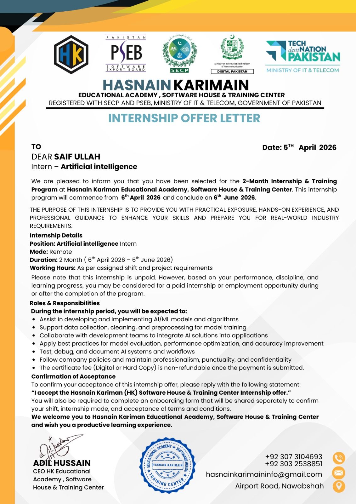

# Internship at Hasnain Karimain (HK) Educational Academy, Software House & Training Center

🎉 **Welcome to my Internship Repository!**  

This repository has been created to document and organize my work during the **2-Month Internship Program** at **Hasnain Karimain (HK) Educational Academy, Software House & Training Center**. I was selected for this program as an **AI Intern**, where I will be working on various AI projects, exploring real-world applications of artificial intelligence, and enhancing my technical skills.  

**📅 Internship Duration:** 6th April 2026 – 6th June 2026  

---

## About the Organization
- Registered with **SECP (Securities and Exchange Commission of Pakistan)** and **PSEB (Pakistan Software Export Board)**  
- Provides a **professional and structured learning environment**  
- Focuses on skill development, discipline, and project-based learning  

---

## My Role and Goals
- Work as an **AI Intern**, contributing to different AI and machine learning projects  
- Apply theoretical knowledge to practical solutions  
- Enhance skills in **deep learning, computer vision, NLP**, and other AI technologies  
- Maintain consistency, professionalism, and meet project deadlines  

---

## Sharing and Collaboration
If you share your offer letter or internship updates on social platforms like **Facebook** or **LinkedIn**, please:  
- Tag the official page: **Hasnain Karimain (HK) Educational Academy, Software House & Training Center**  
- Follow the page for updates  
- Use the provided motivational caption or write your own  

---

This repository will serve as a **record of my learning journey, project implementations, and contributions** during this internship.

---

